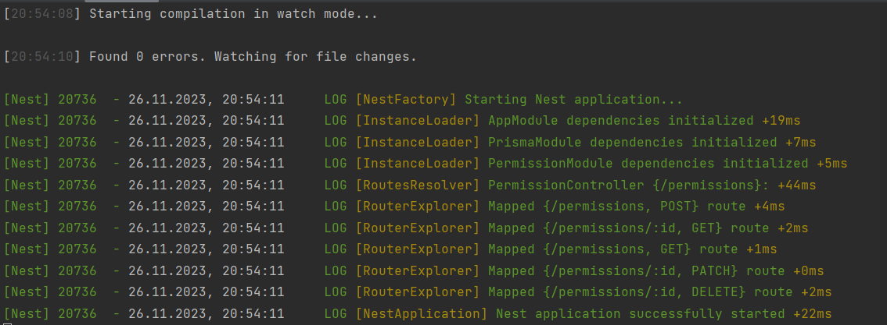
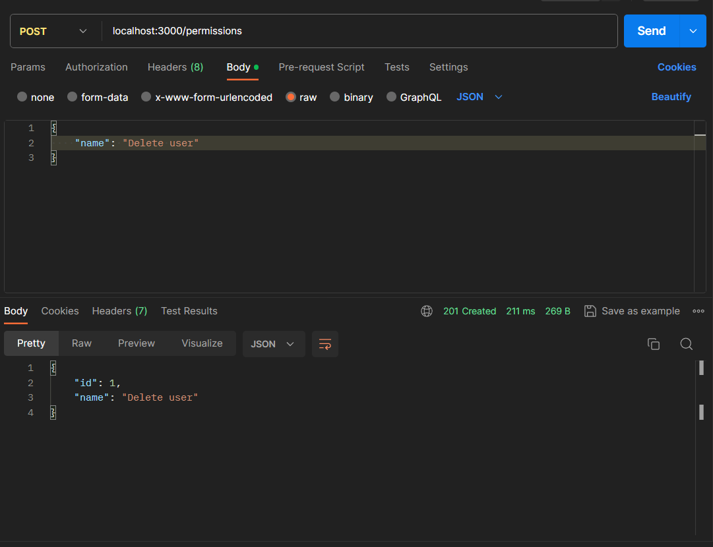
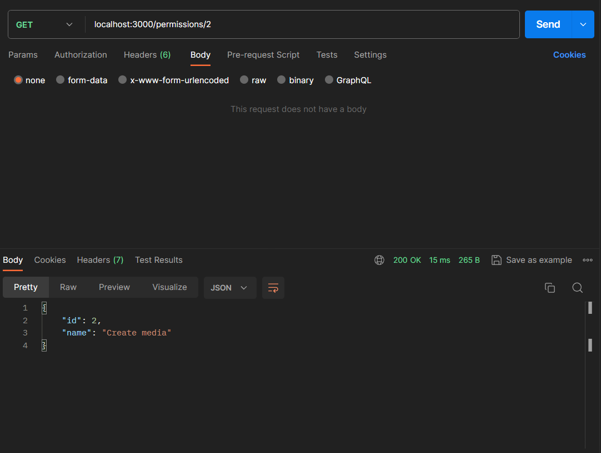
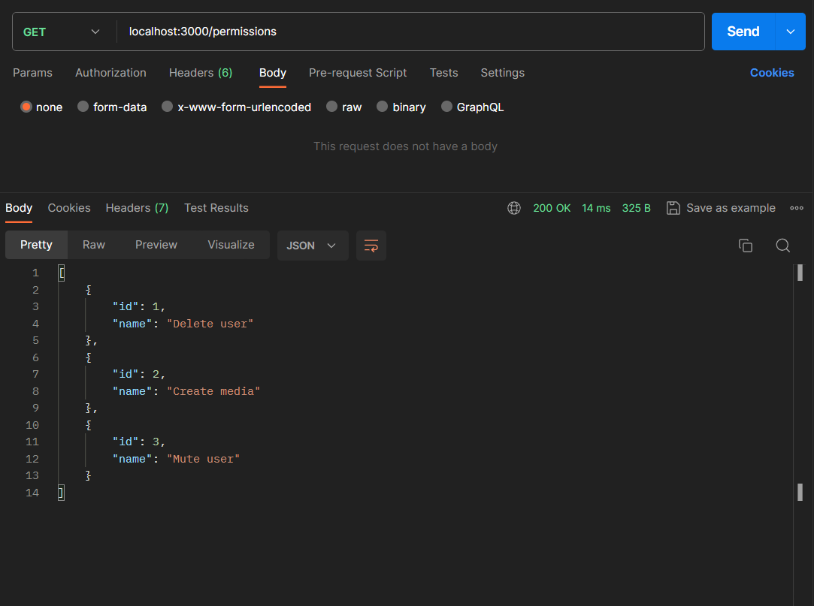
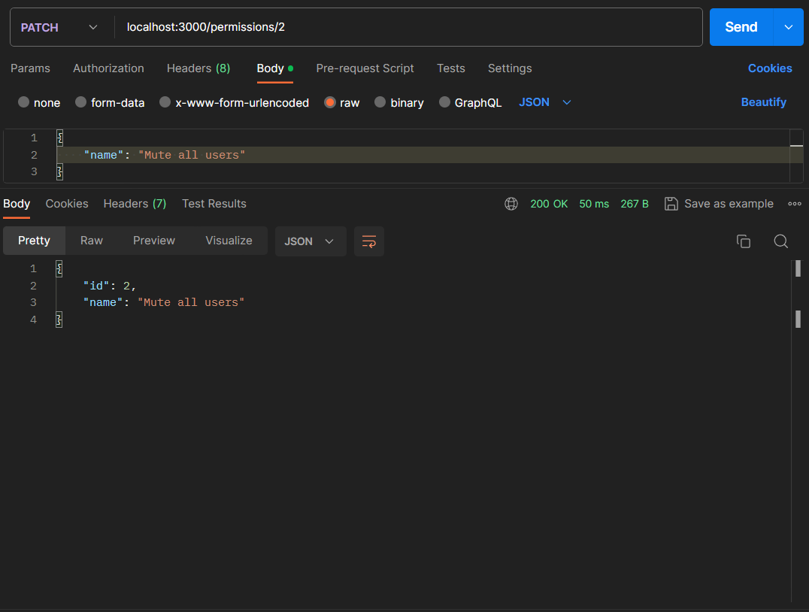
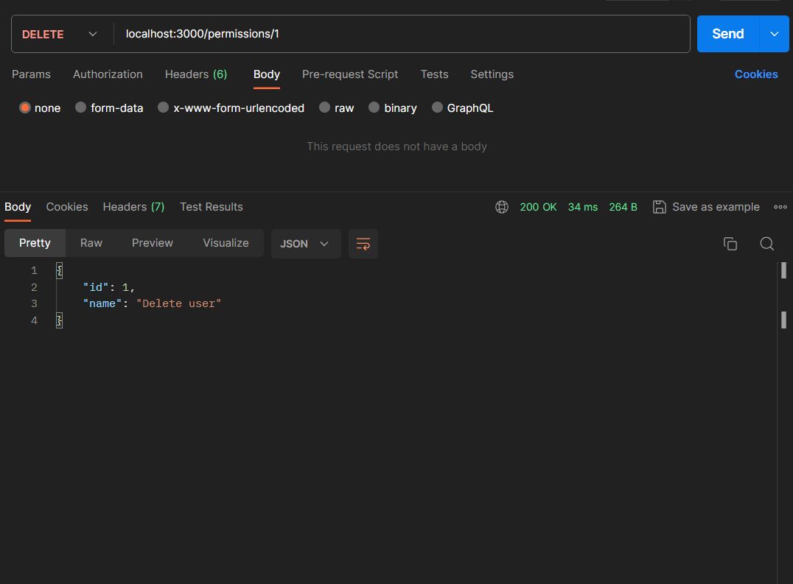
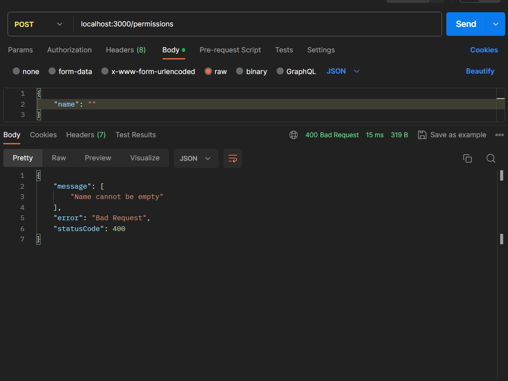
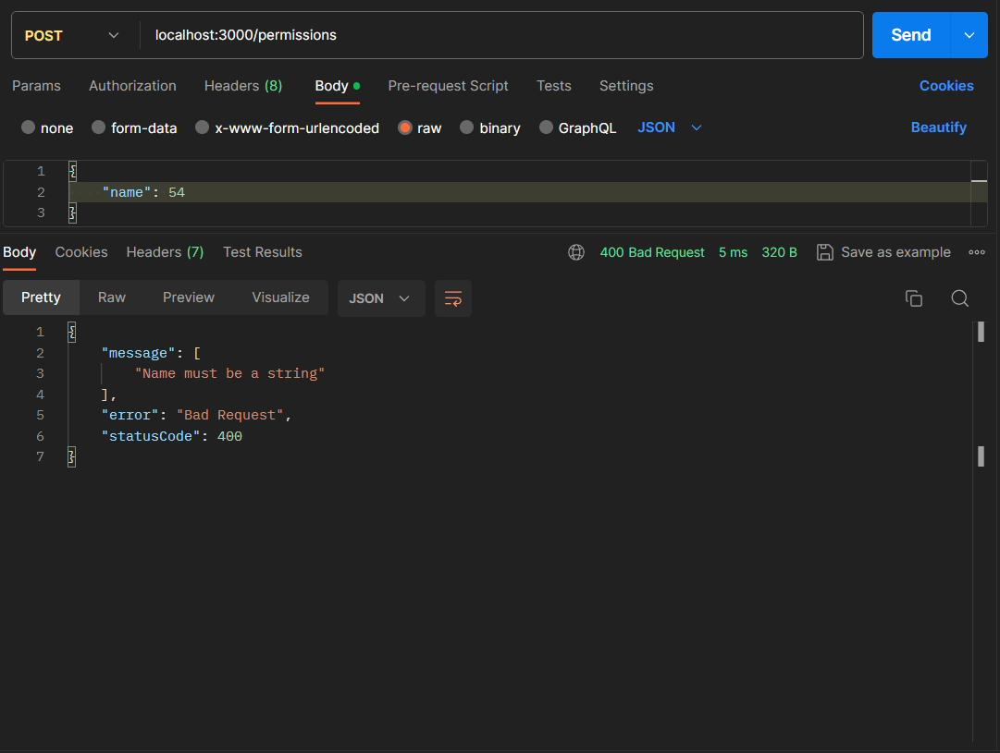
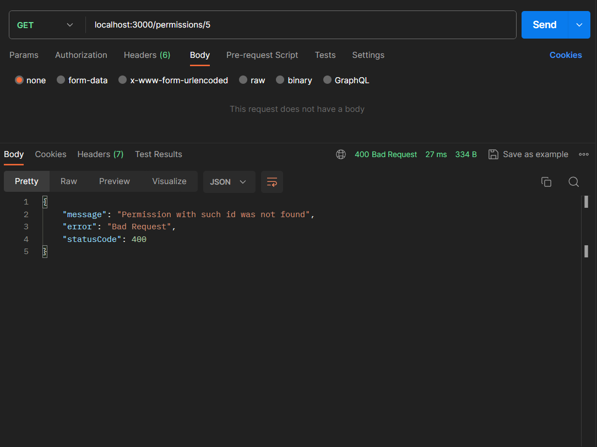

# Тестування працездатності системи

## Запуск Nest додатку

    

## POST-запит

    

## GET-запит (id)

    

## GET-запит (отримати всі)

    

## PATCH-запит

    

## DELETE-запит

    

## Exception: name cannot be empty

    

## Exception: name must be a string

    

## Exception: permission with such id was not found

    

